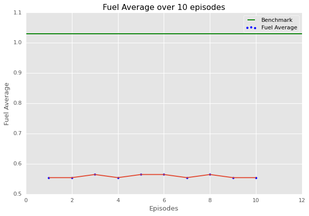
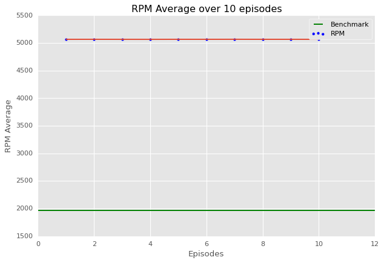
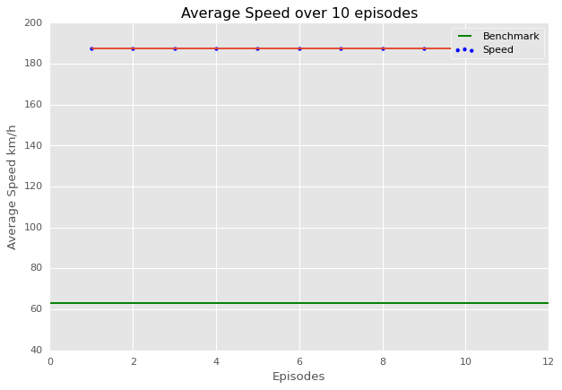
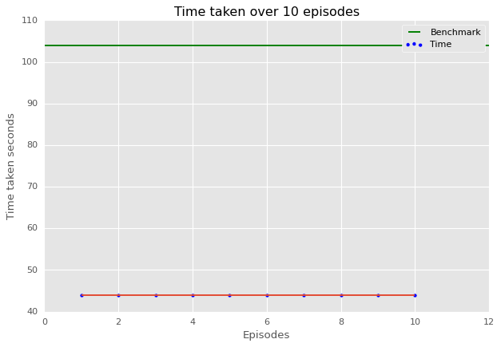

# Fuel-Efficient Vehicle Control with Reinforcement Learning

A reinforcement learning agent trained to drive a simulated vehicle — controlling acceleration, braking, and gear selection — with the goal of minimizing fuel consumption while maintaining target speed and RPM performance.

## Overview

The agent is trained using **Soft Actor-Critic (SAC)**, a state-of-the-art off-policy RL algorithm, against a custom [OpenAI Gym](https://www.gymlibrary.dev/) environment built on top of a live vehicle simulator. The simulator exposes:

- **MQTT** telemetry — real-time vehicle sensor data (speed, engine RPM, fuel consumed, odometer, gear position)
- **REST API** — action interface for sending acceleration, braking, and gear commands, plus simulator start/stop/reset controls

The custom `VehicleEnv` class wraps this simulator into a standard Gym interface (`action_space`, `observation_space`, `step`, `reset`), so it can be trained with any Stable-Baselines3 algorithm.

## How it works

1. **Environment** (`VehicleEnv`) — normalizes simulator telemetry into observations (`vehicle_speed`, `fuel_consumed`, `distance_travelled`, etc.) and denormalizes agent actions back into simulator commands (accelerator %, brake %, gear 1–6)
2. **Training** — a `SAC` agent (multi-input policy) is trained against the environment, with a custom `TensorboardCallback` logging fuel average and step distance for monitoring
3. **Evaluation** — the trained model is run over 10 episodes in deterministic mode, tracking average fuel consumption, RPM, speed, and episode duration
4. **Results** — each metric is plotted across episodes against a fixed benchmark line, to visualize how closely the agent's driving matches target efficiency

## Tech stack

- Python
- [Stable-Baselines3](https://stable-baselines3.readthedocs.io/) (SAC algorithm)
- OpenAI Gym
- TensorFlow
- paho-mqtt (MQTT client)
- Matplotlib (results visualization)
- TensorBoard (training monitoring)

## Setup

```bash
pip install -r requirements.txt
```

Requires a running instance of the KnowGo simulator (see below) to execute training/evaluation cells.

## Simulator

Built against the [KnowGo](https://www.knowgo.io/) vehicle simulator, which exposes:
- an MQTT broker publishing live telemetry under the `knowgo/#` topic
- a local REST API at `http://localhost:8086/simulator/...` for sending actions and controlling the simulator (start/stop/reset)

A running instance of the KnowGo simulator is required to execute the training and evaluation cells — the environment logic and model architecture can still be reviewed directly in the notebook without one.

## Results

The trained SAC agent achieved approximately **8% higher fuel efficiency than human driving** in the simulated environment, evaluated across multiple experiments with different reward function configurations.

| Fuel Average | RPM Average |
|---|---|
|  |  |

| Average Speed | Time per Episode |
|---|---|
|  |  |

Notably, the agent's driving policy was **unconventional compared to human driving**: it consistently ran at higher RPM and speed than the human benchmark, yet still achieved a lower (better) fuel average and completed episodes faster. This reflects a genuinely different — not just "more careful" — driving strategy discovered by the RL agent. As discussed in the thesis, these policies improve fuel economy in simulation but would need adaptation before they could be considered for real-world driving.

Full methodology, related work, and detailed experiment-by-experiment results are documented in the accompanying Master's thesis: **["A Deep Reinforcement Learning Framework for Optimizing Fuel Economy of Vehicles"](https://www.diva-portal.org/smash/get/diva2:1784321/FULLTEXT01.pdf)** (Stockholm University, DiVA), written under the supervision of Sindri Magnússon and Ali Beikmohammadi.

## Background

This project was completed as part of my Master's program, exploring reinforcement learning applied to autonomous vehicle control — specifically, using SAC to learn continuous and discrete-mixed control (accelerator/brake as continuous, gear as an integer) in pursuit of a multi-objective goal: fuel efficiency balanced against speed and drivability.
